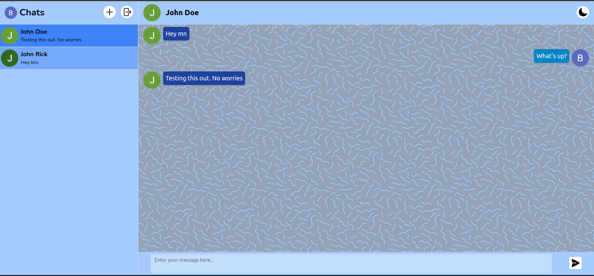
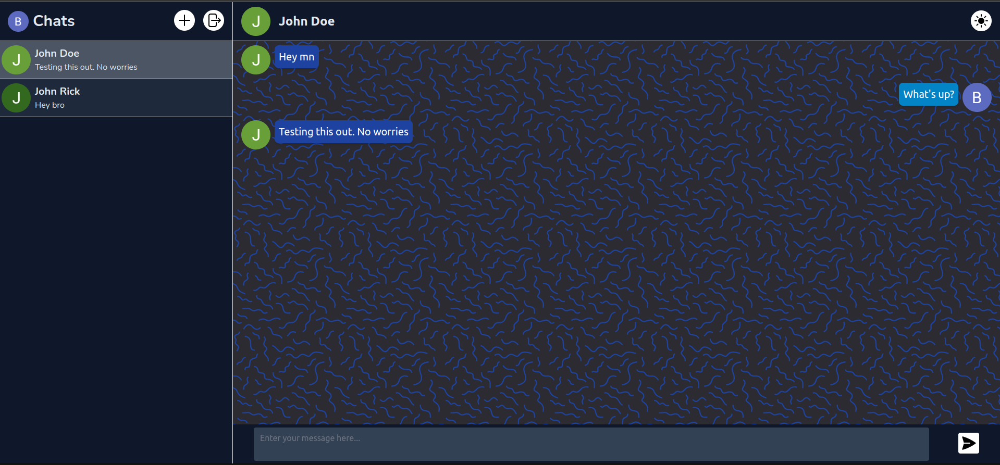

# Mick Chat

This is a Chat App created as a part of The Odin Project in the Javascript course of the NodeJS path.

The live app can be checked out [here](https://mickfrog.github.io/mick-chat)

## Features

1. Sign-up/Login/Logout authentication with Google Authentication
2. Toggle light / dark theme
3. Search others and chats to talk to them
4. Instant messaging

## Theme Previews

### Light Theme



### Dark Theme



## Project Setup

```
git clone git@github.com:MickFrog/mick-chat.git
cd mick-chat
npm install
npm start
```

## Built with

- [React](https://reactjs.org/)
- [Firebase](https://firebase.google.com/)
- [Tailwind CSS](https://tailwindcss.com/)
- [Flowbite React](https://www.flowbite-react.com/)
